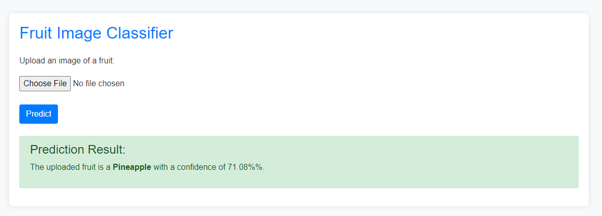
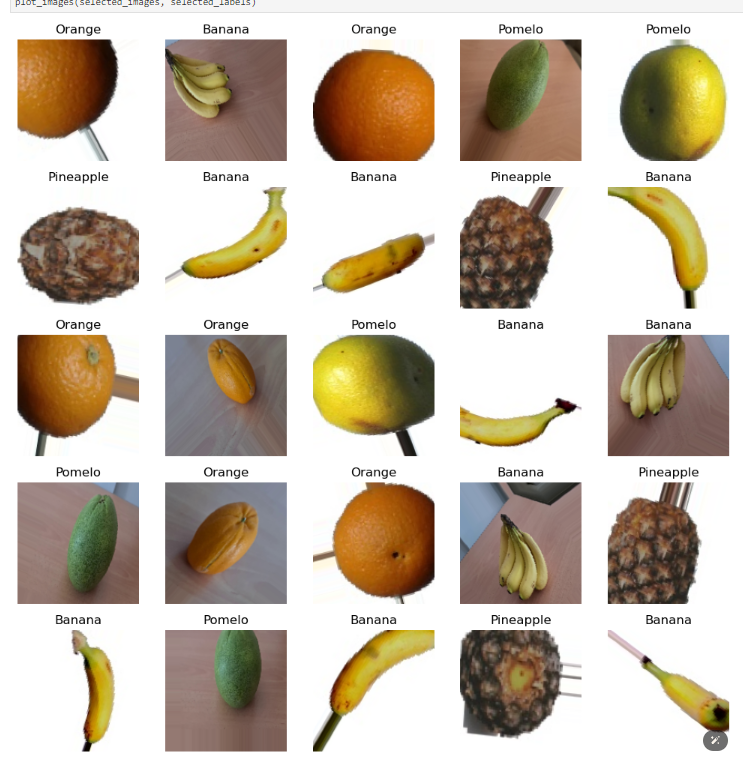

# Fruit Classifier Using CNN



## Motivation
The motivation behind this project is to develop a reliable and efficient fruit classification system using Convolutional Neural Networks (CNN). This system aims to assist businesses in automating the process of identifying different types of fruits, which can be beneficial in various applications such as quality control in food production, inventory management, and sorting in agricultural industries.

## Business Question
The primary business question this project addresses is: "How can we accurately and efficiently classify different types of fruits using machine learning techniques to improve operational processes in the food and agriculture industries?"

## Why This Project?
This project was undertaken to explore the capabilities of deep learning, specifically CNNs, in image classification tasks. By developing a fruit classification system, we aim to demonstrate the effectiveness of CNNs in distinguishing between different categories of fruits based on their visual features. This project can serve as a foundation for more complex systems that require image-based classification.

## Results
The CNN model achieved impressive results in classifying different fruits. Below are the key metrics:

```sh
          precision    recall  f1-score   support

       0       0.96      1.00      0.98        27
       1       1.00      1.00      1.00        23
       2       1.00      0.96      0.98        25

accuracy                           0.99        75
macro avg 0.99 0.99 0.99 75
weighted avg 0.99 0.99 0.99 75
[[27 0 0]
[ 0 23 0]
[ 1 0 24]]
```



The model demonstrated high precision, recall, and f1-score across all classes, indicating its effectiveness in distinguishing between different types of fruits.

## Running the Project
To run the project, follow these steps:

1. Clone the repository:
    ```sh
    git clone https://github.com/boss2256/Fruit-Classifier-App.git
    cd Fruit-Classifier-App
    ```

2. Install the required dependencies:
    ```sh
    pip install -r requirements.txt
    ```

3. Run the application:
    ```sh
    flask run
    ```

## Technical Details
The system is built using the following steps:

1. **Capture Images**: Collect a dataset of fruit images.
2. **Data Augmentation and Generators**: Apply data augmentation techniques and prepare data generators for training and testing.
3. **CNN Model Architecture**: Define and compile a CNN model with multiple convolutional layers, max-pooling layers, and fully connected layers.
4. **Model Training**: Train the CNN model on the augmented dataset.
5. **Model Evaluation**: Evaluate the model's performance on the test dataset.
6. **Save Model**: Save the trained model for future predictions.
7. **Load and Use the Model for Predictions**: Load the saved model and use it to make predictions on new fruit images.

## Model Performance
The CNN model was trained and evaluated on a dataset of fruit images, achieving high accuracy and demonstrating excellent performance in classifying different fruit types. The model's robust architecture and the use of data augmentation techniques contributed to its effectiveness.

For more details on the model architecture, training process, and performance metrics, please refer to the `Fruit_Classifier_CNN_TrainingData.pdf` document included in this repository.
